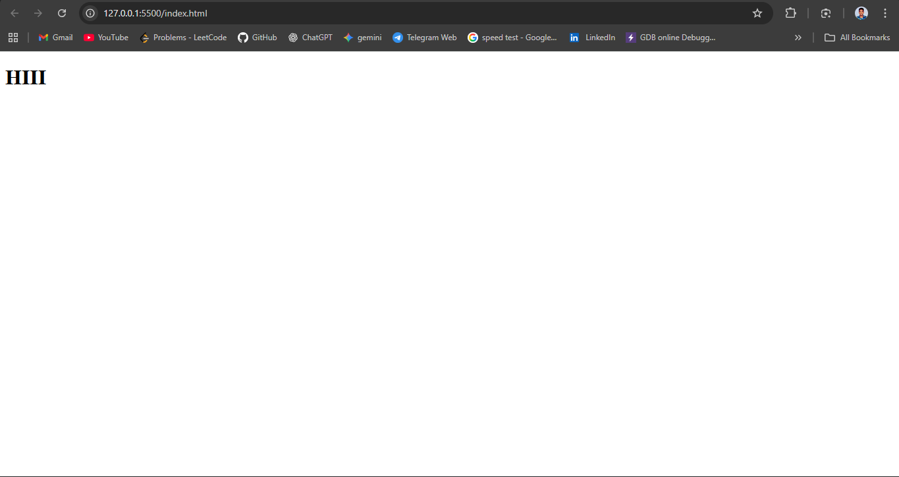

# Concept
### 1.Purpose of HTML, Browsers, How HTML Fits with CSS & JS

---

## 🌐 Purpose of HTML
- **HTML (HyperText Markup Language)** is the foundation of any webpage.  
- Think of it as the **skeleton** or **blueprint** of a website.  
- Its purpose:  
  1. **Structure content** → headings, paragraphs, images, links, tables, forms.  
  2. **Semantics** → tags (`<header>`, `<nav>`, `<article>`) give meaning to content for browsers, search engines, and screen readers.  
  3. **Hyperlinks** → allows navigation between pages.  
  4. **Accessibility** → ensures content is understandable for all users.  

Without HTML, there’s no “webpage”—just an empty browser.  

---

## 🖥️ Role of Browsers
- A **browser (Chrome, Firefox, Safari, Edge)** is like a translator.  
- It:  
  1. Reads the **HTML file**.  
  2. Applies **CSS styles** to make it look nice.  
  3. Executes **JavaScript** to make it interactive.  

---

## 🎨 How HTML Fits with CSS & JS
👉 **HTML, CSS, and JavaScript** are for web development. They play different but complementary roles:  

1. **HTML (Structure)** → The skeleton of the page.  
   - Example:  
     ```html
     <button>Click Me</button>
     ```  

2. **CSS (Style)** → The clothes & makeup.  
   - Example:  
     ```css
     button {
       background: blue;
       color: white;
       padding: 10px;
       border-radius: 5px;
     }
     ```  

3. **JavaScript (Behavior)** → The brain & muscles.  
   - Example:  
     ```javascript
     document.querySelector("button").addEventListener("click", () => {
       alert("Button clicked!");
     });
     ```
### 2. Basic HTML File setup

- In the each and every program has the thir own platforms like c in turbo-c,and python pycharm
- Now we are advancing technology in Vs code we are executeing the all languages for that we download or install thir packages or applications or software to run the laguages in vs code 
- For the html we don't want the any other this for this 
- in side your browser it directly its run because of dom(document object modeling) superts browser engine
- To run this in your system just save the file name and along with extension .HTML to run the html code 

```python
file_name.html
```

## Practice: Create `index.html`, add `<!doctype html>`, `<html>`, `<head>`, `<body>`

```Html

<!DOCTYPE html>
<html lang="en">
<head>
    <meta charset="UTF-8">
    <meta name="viewport" content="width=device-width, initial-scale=1.0">
    <title>Document</title>
</head>
<body>
    <h1>HIII</h1>
</body>
</html>
```


- In vs code extensions install the Live server
- Click the Go live 
- in Default web browser it run the html code